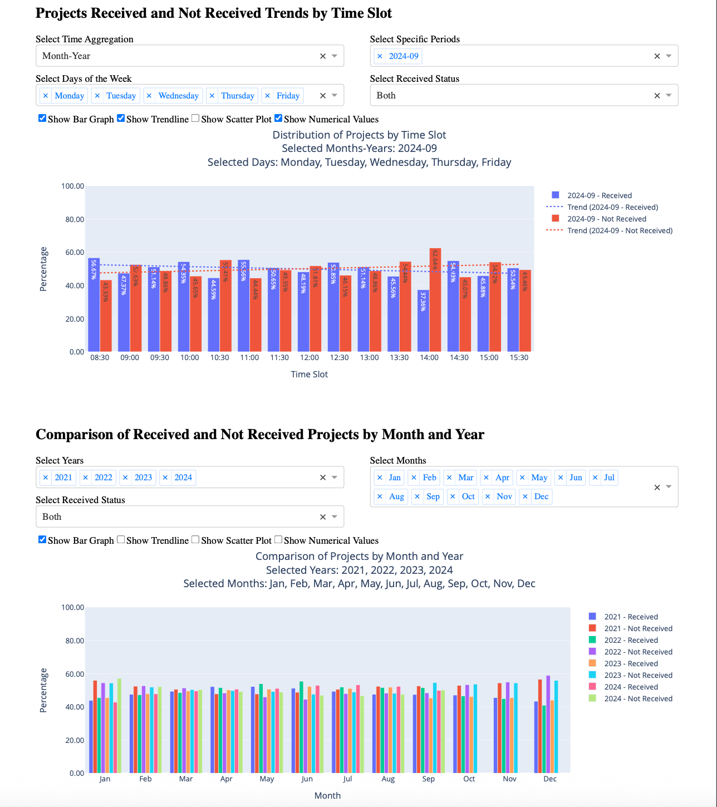

# Project Submission Dashboard
An interactive data visualization dashboard for analyzing project submission patterns across different time slots. Built with Dash and Plotly, this tool helps identify peak submission times and trends to optimize resource allocation and workflow management.


[](https://python.org)
[](https://dash.plotly.com/)
[](https://plotly.com/)

<br>

[](https://timeslotdb.onrender.com/)
[](https://github.com/kmcerr/timeslotdb.git)

<br>



</div>

## Overview

This dashboard provides comprehensive insights into project submission patterns by analyzing:
- **When** projects are submitted throughout the day
- **How** submission rates vary across different time periods
- **What** trends emerge over months and years
- **Which** days of the week show different patterns

## Key Features

### Dual Analysis Views
1. **Time Slot Distribution Analysis**
   - Visualize submission patterns across 15 time slots (8:30 AM - 3:30 PM)
   - Compare received vs. not received rates
   - Identify peak and off-peak hours

2. **Temporal Comparison Analysis**
   - Month-by-month yearly comparisons
   - Year-over-year trend analysis
   - Seasonal pattern identification

### Dynamic Filtering Options
- **Time Aggregation**: Month-Year, Month Only, Year Only, or Day
- **Period Selection**: Choose specific time periods to analyze
- **Day Filtering**: Focus on specific weekdays
- **Status Filtering**: View Received, Not Received, or Both

### Visualization Options
- **Bar Charts**: Direct comparison of values
- **Scatter Plots**: Distribution visualization with markers
- **Trend Lines**: Linear regression to show trends
- **Numerical Display**: Toggle exact percentage values

## Technical Architecture

```
┌─────────────────┐     ┌──────────────────┐     ┌─────────────────┐
│  DataProcessor  │────▶│  DashboardApp    │────▶│  GraphBuilder   │
│  (ETL Pipeline) │     │  (Core Logic)    │     │  (Visualization)│
└─────────────────┘     └──────────────────┘     └─────────────────┘
        │                        │                         │
        ▼                        ▼                         ▼
   • CSV Loading           • Layout Design          • Plotly Figures
   • Data Cleaning         • Callback Logic         • Color Schemes
   • Type Conversion       • State Management       • Trend Analysis
   • Validation            • User Interaction       • Responsive Design
```

### Core Components

#### DataProcessor Class
Robust data handling with error recovery:
```python
def load_data(file_path):
    # Handles multiple date/time formats
    # Standardizes received status (0/1, text variations)
    # Creates derived columns (month_year, day_name)
    # Validates data integrity
```

**Key Features:**
- Flexible date parsing with `pd.to_datetime`
- Categorical month ordering for proper sorting
- Automatic time format standardization (HH:MM)
- Comprehensive error logging

#### GraphBuilder Class
Advanced visualization engine:
```python
def create_trend_figure(...):
    # Supports multiple trace types simultaneously
    # Dynamic color cycling for unlimited series
    # Unified hover mode for better UX
    # Responsive layout adjustments
```

**Visualization Capabilities:**
- Polynomial trend line fitting (excludes nulls/zeros)
- Custom hover templates with formatted percentages
- Automatic text positioning for value labels
- Category ordering for consistent x-axis

#### DashboardApp Class
Interactive dashboard framework:
```python
def _setup_callbacks():
    # Reactive UI updates
    # Efficient data filtering
    # Dynamic component visibility
    # Cross-filter coordination
```
**Interactive Features:**
- Cascading dropdown updates
- Conditional UI element display
- Real-time graph regeneration
- Multi-select filtering

## Data Requirements

### Input Format
CSV file with the following structure:

| Column | Type | Format | Description | Valid Values |
|--------|------|--------|-------------|--------------|
| `date` | Date | YYYY-MM-DD | Submission date | Any valid date |
| `time` | Time | HH:MM:SS | Submission time | 24-hour format |
| `received` | Mixed | Various | Status indicator | 0/1, '0'/'1', 'received'/'not_received' |

## Technology Stack
- Framework: [Dash](https://dash.plotly.com/) - Python framework for building analytical web applications
- Visualization: [Plotly](https://plotly.com/) - Interactive data visualization library
- Demo Hosting: [Render](https://render.com/) - Web application hosting platform